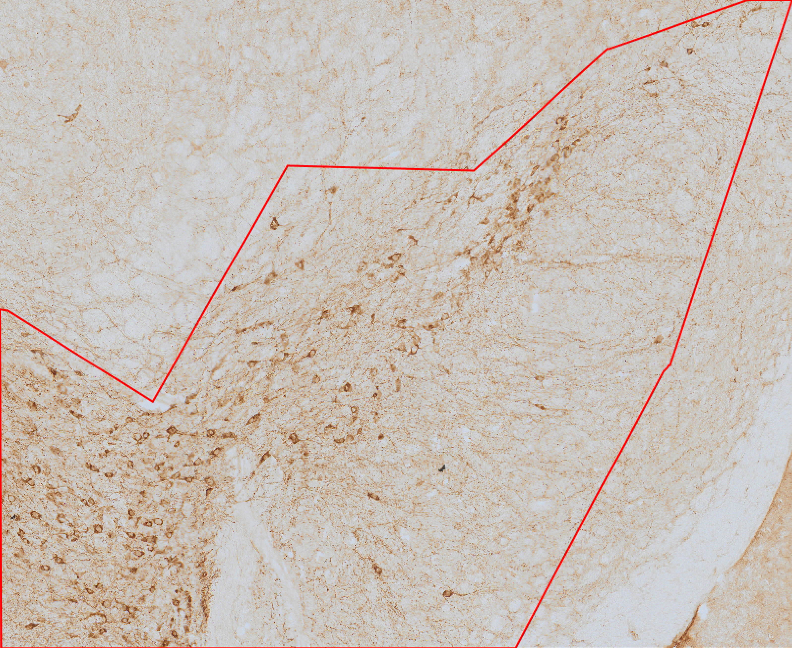
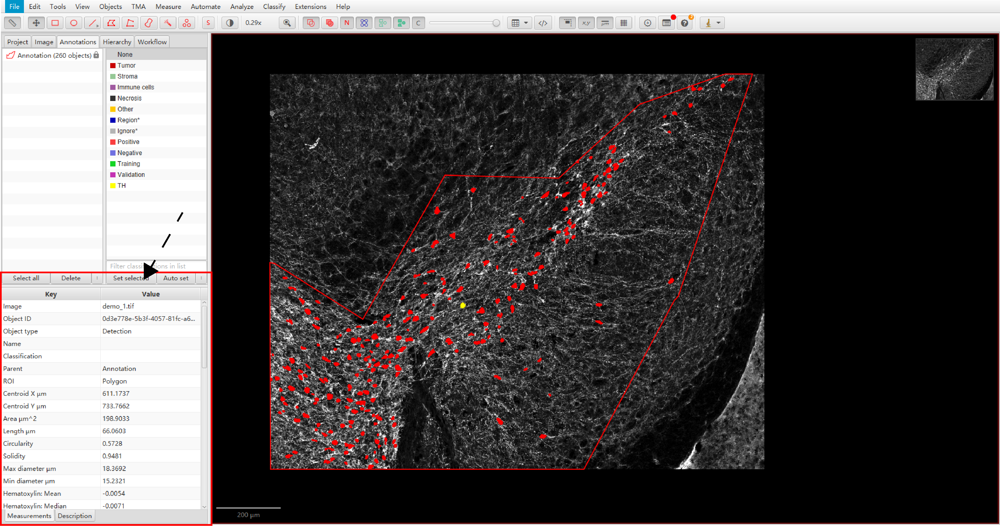

# TrueTH
Fine-tuned TH soma identification pipeline.

## Installation
Before running this workflow, you need to install QuPath and Cellpose:
1. Install QuPath 0.5.0 following: https://github.com/qupath/qupath/releases/tag/v0.5.0
2. Install Cellpose and QuPath-extension-cellpose following：https://github.com/BIOP/qupath-extension-cellpose
3. Add the TrueTH model path to "[IHC_DAB_channel_auto_detect](script/IHC_DAB_channel_auto_detect.groovy)"and "[IF_red_channel_detection](script/IF_red_channel_detection.groovy)"scripts

## Getting started
To execute entire workflow, available scripts must be executed in following order:
1. Open QuPath, create a project, add your images and set the image type to H-DAB or Fluorescence. Creat the annotation for the region you want to analysis, such as SNc.
 

2. Preform cell detection:
Run the "[IHC_DAB_channel_auto_detect.groovy](script/IHC_DAB_channel_auto_detect.groovy)" for IHC images or "[IF_red_channel_detection.groovy](script/IF_red_channel_detection.groovy)" for florescence images, the script also can use the 'run for project' button to execute batch processing.  
 

3. Add detection intensity measurements:
Run "[Add full intensity measurements to detection.groovy](<script/Add full intensity measurements to detection.groovy>)" to add intensity measurements for every channel,the script can use 'run for project' button to execute batch processing.  
 

4. Postprocess:
Run "[Cell filter.groovy](<script/Cell filter.groovy>)" for cell filter, this step filter out the small false detection and black artifacts, use 'run for project' button to execute batch processing.  
Before:  
    ](image/image_4.png)  
After:  
    ](image/image_5.png)

5. For cell counts and detection intensity data:
Run "[export cell counts detection.groovy](<script/export cell counts detection.groovy>)" to export the cell counts and measurements in all images.

6. For cell binary image:
Run "[export binary image.groovy](<script/export binary image.groovy>)" to export the cell detection binaray images, use 'run for project' button to execute batch processing.
The results are stored in the 'detection' directory in the QuPath project directory.

## Support and contact
Create a GitHub issue. We will typically respond within three day or one week.

## Citation
If you use TrueTH in your work, please cite the TrueTH publication as follows:
Chen J, Meng Q, Zhang Y, et al. TrueTH: A user-friendly deep learning approach for robust dopaminergic neuron detection. Neuroscience Letters. doi:10.1016/j.neulet.2024.137871